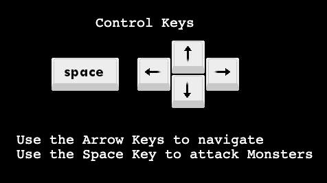
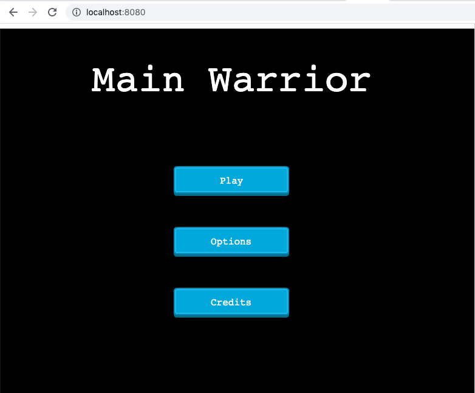
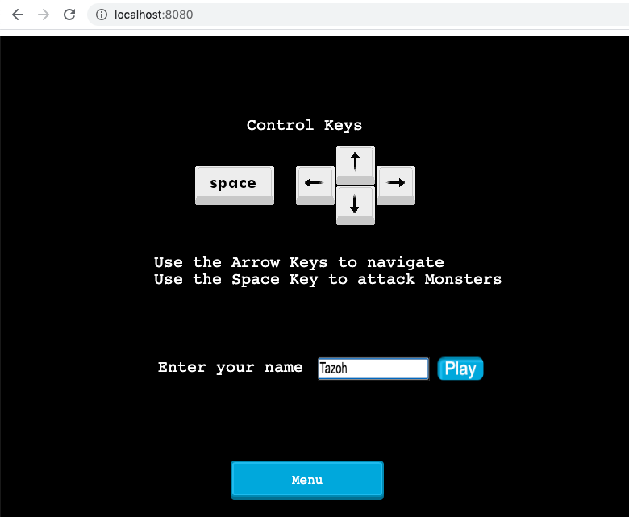
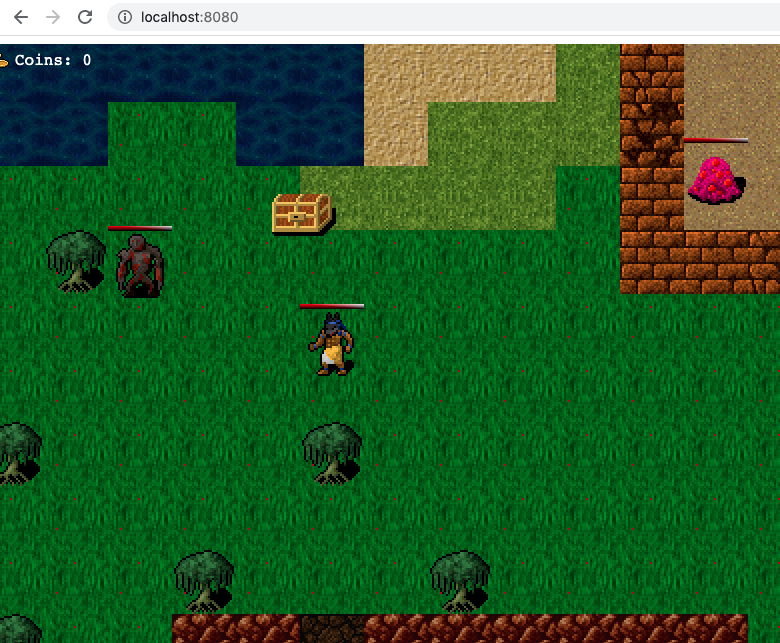

<p align="center">
     <a href="https://github.com/t-yanick/rpg-capstone">
    
  </a>

  <h3 align="center">JavaScript / Capstone --> [Main Warrior]</h3>

  <p align="center">
    This project is the Capstone of the Microverse curriculum at the end of the JavaScript module!
    <br />
    <a href="https://github.com/t-yanick/rpg-capstone"><strong>Explore the docs »</strong></a>
    <br />
    <br />
    <a href="https://github.com/t-yanick/rpg-capstone/issues">Report Bug</a>
    ·
    <a href="https://github.com/t-yanick/rpg-capstone/issues">Request Feature</a>
  </p>
</p>

<!-- TABLE OF CONTENTS -->
## Table of Contents

* [About the Project](#about-the-project)
  * [Built With](#built-with)
  * [Deployment (GitHub-Pages)](#deployment-(gitHub-pages))
* [Usage](#usage)
* [Contributors](#contributors)
* [Acknowledgements](#acknowledgements)
* [License](#license)

<!-- ABOUT THE PROJECT -->
## About The Project

This project is the last project in the JavaScript Module of the Microverse Technical Curriculum. It proves that the module has been completed.

This project is based on a turn-based RPG game and the main action is based on collecting chests and attacking and killing monsters.

### How to Play



The game can be played using the arrow keys for moving the player and the spacebar for attacking the monster.
By moving the player you will be able to collect chests that contain gold. Each chest will update the score with a random amount between 20 and 30 golds.

Each character has a health bar. The monster's health bar will decrease each time the player will attack, but watch out, the monsters have a random movement and each time you will attack they will fight back making your health bar decrease.
As a bonus though, for each monster killed the player will have back some gold and some life to increase his health bar.

### Design Process

Main Warrior was designed on an initial, quite complex, webpack configuration specific for Phaser3. This allowed me to investigate Phaser and its tools from a specific perspective. The entire map was built with Tiled on a 32 x 32 collection of squares. The map then has been exported as a json file and used for placing chests, and monsters at random positions.

The player has a set velocity and can move across the map by using the arrow keys. Each time the player dies it will be spawned at a different random position to make the game more interesting. The monsters and the chests will be as well randomly generated and spawned on the map. Each spawned element has a random unique id used to interact with the user. The unique id is generated with the help of uuid npm package.

### Built With
This project was built using the technologies below.
* JavaScript
* Phaser3
* Webpack
* Jest Tests
* Tiled Map

<!-- Live Demo -->
## Deployment (GitHub-Pages)
##
* Live Demo Link --> App Deployed with GitHub-Pages: [Main Warrior](https://t-yanick.github.io/rpg-capstone/)

## Screenshots




### Getting Started

To get a local copy up and running follow these simple example steps.

### Prerequisites

 * [Node.js](https://nodejs.org/) is required to install dependencies and run scripts via npm.
 * A modern browser

### Clone
* [download](https://github.com/t-yanick/rpg-capstone/archive/refs/heads/development.zip) or clone this repo:
  - Clone with SSH:
  ```
    git@github.com:t-yanick/rpg-capstone.git
  ```
  - Clone with HTTPS
  ```
    https://github.com/t-yanick/rpg-capstone.git

### Setup

Install dependencies:

```
$ npm install
```

Start the local webserver:

```$ npm start``` > will open a local webserver at http://localhost:8080/ directly in your default browser with the game ready to be played

  ## Automated Test

* Run the command and see the output:
```$ npm run test```


 ## Potential future features
- Extend the game to a multiplayer online game
- Add authentication process

## Contributors

👤 **Tazoh Yanick Tazoh**

- LinkedIn: [Tazoh Yanick Tazoh](https://www.linkedin.com/in/tazoh-yanick-tazoh/)
- GitHub: [@t-yanick](https://github.com/t-yanick)
- Twitter: [@ElTazoh](https://twitter.com/ElTazoh)

## Contributing

Contributions, issues and feature requests are welcome!

Feel free to check the [issues page](Contributions, issues and feature requests are welcome!

Feel free to check the [issues page](https://github.com/t-yanick/rpg-capstone/issues).


## Show your support

Give a :star: if you like this project!

<!-- ACKNOWLEDGEMENTS -->
## Acknowledgements
* [SFX effects](https://opengameart.org/) - OpenGameArt website
* [Phaser3](https://phaser.io/phaser3) 
* [Microverse](https://www.microverse.org/)

## 📝 License

This project is [MIT](https://opensource.org/licenses/MIT) licensed.


